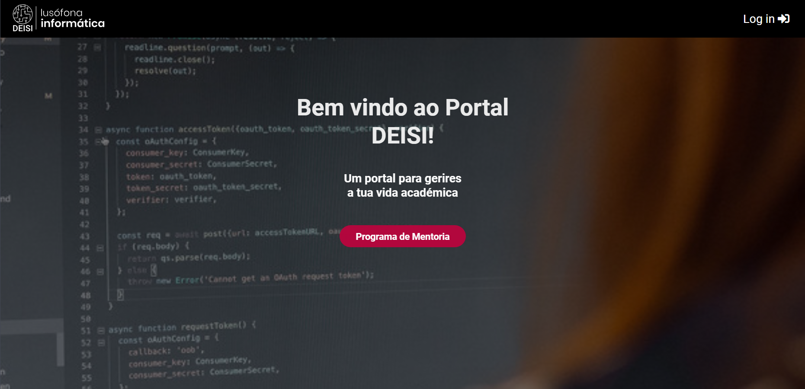

# Mentorias
https://mentoriasdeisi.pythonanywhere.com/

# Horários
https://horariosdeisi.pythonanywhere.com/

## Video demo
https://educast.fccn.pt/vod/clips/1xx3o22hlo/desktop.mp4?locale=pt

# Texto e Imagem de apresentação
O Departamento de Engenharia Informática e Sistemas de Informação (DEISI) é um departamento onde estão envolvidos alunos, professores, cadeiras, horários, etc. O que se pretende com este trabalho é, através de endpoints, de uma forma dinâmica, recolher a informação do departamento e utilizar estes dados em diversas aplicações web, a desenvolver para alunos e professores.
Foram desenvolvidas duas aplicações: uma para gestão do Programa de Mentoria (na qual os utilizadores podem ser mentores ou mentorandos e registar sessões) e outra para escolha de horários universitários (na qual os alunos acedem à nossa plataforma para registarem as suas preferências de horário ou mudanças de turma/turno).





## Recuperação da password
[Video demo](https://github.com/DEISI-apps/cvp/blob/main/demo_autenticacao.mp4) 

## Testes
Para a realização de testes, altere as seguintes definições no ficheiro settings.py:

```Python
DATABASES = {
    'default': {
       'ENGINE': 'django.db.backends.sqlite3',
        'NAME': BASE_DIR / 'db.sqlite3',
        #'ENGINE': 'django.db.backends.mysql',
        #'NAME': '',
        #'USER': '',
        #'PASSWORD': '',
        #'HOST': '',
        #'PORT': '3306',
        #'OPTIONS': {
        #'init_command': "SET sql_mode='STRICT_TRANS_TABLES'",
        #    }
        },
    }
]
```
Username -> admin
Password -> admin


